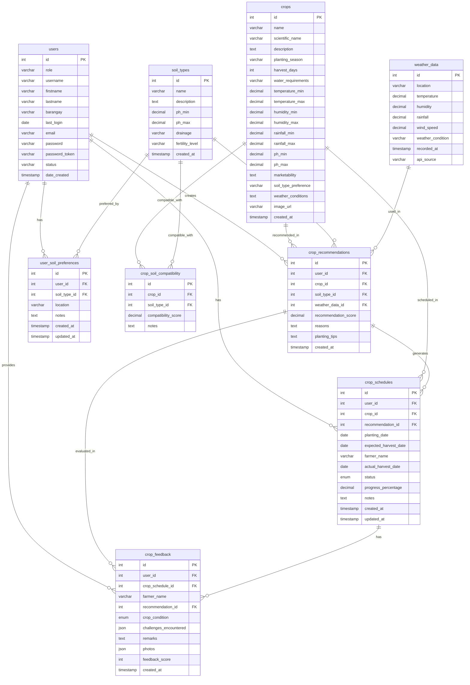

# GrowCalendar Database - Entity Relationship Diagram (ERD)

## Database: growcalendar_db

This document provides a comprehensive ERD for the GrowCalendar Crop Recommendation System database.

---

## ERD Diagram (Mermaid Format)

---

## Table Descriptions

### 1. users

**Purpose**: Stores user account information for both farmers and administrators.

| Column         | Type         | Constraints                 | Description                         |
| -------------- | ------------ | --------------------------- | ----------------------------------- |
| id             | INT          | PRIMARY KEY, AUTO_INCREMENT | Unique user identifier              |
| role           | VARCHAR(255) | NOT NULL                    | User role (e.g., 'farmer', 'admin') |
| username       | VARCHAR(255) | NOT NULL                    | Unique username                     |
| firstname      | VARCHAR(255) | NOT NULL                    | User's first name                   |
| lastname       | VARCHAR(255) | NOT NULL                    | User's last name                    |
| barangay       | VARCHAR(255) | NOT NULL                    | User's location (barangay)          |
| last_login     | DATE         | NULL                        | Last login date                     |
| email          | VARCHAR(255) | NOT NULL                    | User's email address                |
| password       | VARCHAR(255) | NOT NULL                    | Hashed password                     |
| password_token | VARCHAR(255) | NOT NULL                    | Password reset token                |
| status         | VARCHAR(10)  | DEFAULT 'Active'            | Account status                      |
| date_created   | TIMESTAMP    | DEFAULT CURRENT_TIMESTAMP   | Account creation date               |

---

### 2. crops

**Purpose**: Stores crop information including environmental requirements and characteristics.

| Column               | Type         | Constraints                 | Description                   |
| -------------------- | ------------ | --------------------------- | ----------------------------- |
| id                   | INT          | PRIMARY KEY, AUTO_INCREMENT | Unique crop identifier        |
| name                 | VARCHAR(100) | NOT NULL                    | Crop name                     |
| scientific_name      | VARCHAR(150) | NULL                        | Scientific name               |
| description          | TEXT         | NULL                        | Crop description              |
| planting_season      | VARCHAR(50)  | NULL                        | Preferred planting season     |
| harvest_days         | INT          | NULL                        | Days to harvest               |
| water_requirements   | VARCHAR(50)  | NULL                        | Water needs (High/Medium/Low) |
| temperature_min      | DECIMAL(4,1) | NULL                        | Minimum temperature (°C)      |
| temperature_max      | DECIMAL(4,1) | NULL                        | Maximum temperature (°C)      |
| humidity_min         | DECIMAL(4,1) | NULL                        | Minimum humidity (%)          |
| humidity_max         | DECIMAL(4,1) | NULL                        | Maximum humidity (%)          |
| rainfall_min         | DECIMAL(6,2) | NULL                        | Minimum rainfall (mm)         |
| rainfall_max         | DECIMAL(6,2) | NULL                        | Maximum rainfall (mm)         |
| ph_min               | DECIMAL(3,1) | NULL                        | Minimum soil pH               |
| ph_max               | DECIMAL(3,1) | NULL                        | Maximum soil pH               |
| marketability        | TEXT         | NULL                        | Market information            |
| soil_type_preference | VARCHAR(255) | NULL                        | Preferred soil types          |
| weather_conditions   | TEXT         | NULL                        | Weather requirements          |
| image_url            | VARCHAR(255) | NULL                        | Crop image URL                |
| created_at           | TIMESTAMP    | DEFAULT CURRENT_TIMESTAMP   | Record creation date          |

---

### 3. soil_types

**Purpose**: Stores different soil type classifications and their properties.

| Column          | Type         | Constraints                 | Description                 |
| --------------- | ------------ | --------------------------- | --------------------------- |
| id              | INT          | PRIMARY KEY, AUTO_INCREMENT | Unique soil type identifier |
| name            | VARCHAR(100) | NOT NULL                    | Soil type name              |
| description     | TEXT         | NULL                        | Soil type description       |
| ph_min          | DECIMAL(3,1) | NULL                        | Minimum pH level            |
| ph_max          | DECIMAL(3,1) | NULL                        | Maximum pH level            |
| drainage        | VARCHAR(50)  | NULL                        | Drainage quality            |
| fertility_level | VARCHAR(50)  | NULL                        | Fertility level             |
| created_at      | TIMESTAMP    | DEFAULT CURRENT_TIMESTAMP   | Record creation date        |

---

### 4. crop_soil_compatibility

**Purpose**: Junction table linking crops to compatible soil types with compatibility scores.

| Column              | Type                    | Constraints                  | Description                     |
| ------------------- | ----------------------- | ---------------------------- | ------------------------------- |
| id                  | INT                     | PRIMARY KEY, AUTO_INCREMENT  | Unique identifier               |
| crop_id             | INT                     | FOREIGN KEY → crops(id)      | Crop identifier                 |
| soil_type_id        | INT                     | FOREIGN KEY → soil_types(id) | Soil type identifier            |
| compatibility_score | DECIMAL(3,2)            | DEFAULT 0.00                 | Compatibility score (0.00-1.00) |
| notes               | TEXT                    | NULL                         | Additional notes                |
| **UNIQUE KEY**      | (crop_id, soil_type_id) |                              | Ensures unique crop-soil pairs  |

**Relationships**:

- Many-to-Many: crops ↔ soil_types

---

### 5. weather_data

**Purpose**: Stores weather information from API sources for crop recommendations.

| Column            | Type         | Constraints                 | Description                         |
| ----------------- | ------------ | --------------------------- | ----------------------------------- |
| id                | INT          | PRIMARY KEY, AUTO_INCREMENT | Unique weather record identifier    |
| location          | VARCHAR(100) | NOT NULL                    | Location name                       |
| temperature       | DECIMAL(4,1) | NULL                        | Temperature (°C)                    |
| humidity          | DECIMAL(4,1) | NULL                        | Humidity (%)                        |
| rainfall          | DECIMAL(6,2) | NULL                        | Rainfall (mm)                       |
| wind_speed        | DECIMAL(4,1) | NULL                        | Wind speed (km/h)                   |
| weather_condition | VARCHAR(50)  | NULL                        | Weather condition description       |
| recorded_at       | TIMESTAMP    | DEFAULT CURRENT_TIMESTAMP   | Record timestamp                    |
| api_source        | VARCHAR(50)  | NULL                        | API source (e.g., 'OpenWeatherMap') |

---

### 6. user_soil_preferences

**Purpose**: Stores user-specific soil type preferences and locations.

| Column       | Type         | Constraints                         | Description          |
| ------------ | ------------ | ----------------------------------- | -------------------- |
| id           | INT          | PRIMARY KEY, AUTO_INCREMENT         | Unique identifier    |
| user_id      | INT          | FOREIGN KEY → users(id)             | User identifier      |
| soil_type_id | INT          | FOREIGN KEY → soil_types(id)        | Soil type identifier |
| location     | VARCHAR(100) | NULL                                | Location description |
| notes        | TEXT         | NULL                                | User notes           |
| created_at   | TIMESTAMP    | DEFAULT CURRENT_TIMESTAMP           | Record creation date |
| updated_at   | TIMESTAMP    | DEFAULT CURRENT_TIMESTAMP ON UPDATE | Last update date     |

**Relationships**:

- Many-to-One: user_soil_preferences → users
- Many-to-One: user_soil_preferences → soil_types

---

### 7. crop_recommendations

**Purpose**: Stores crop recommendations generated for users based on various factors.

| Column               | Type         | Constraints                    | Description                      |
| -------------------- | ------------ | ------------------------------ | -------------------------------- |
| id                   | INT          | PRIMARY KEY, AUTO_INCREMENT    | Unique recommendation identifier |
| user_id              | INT          | FOREIGN KEY → users(id)        | User identifier                  |
| crop_id              | INT          | FOREIGN KEY → crops(id)        | Crop identifier                  |
| soil_type_id         | INT          | FOREIGN KEY → soil_types(id)   | Soil type identifier             |
| weather_data_id      | INT          | FOREIGN KEY → weather_data(id) | Weather data identifier          |
| recommendation_score | DECIMAL(3,2) | NULL                           | Recommendation score (0.00-1.00) |
| reasons              | TEXT         | NULL                           | Reasons for recommendation       |
| planting_tips        | TEXT         | NULL                           | Planting tips and advice         |
| created_at           | TIMESTAMP    | DEFAULT CURRENT_TIMESTAMP      | Recommendation creation date     |

**Relationships**:

- Many-to-One: crop_recommendations → users
- Many-to-One: crop_recommendations → crops
- Many-to-One: crop_recommendations → soil_types
- Many-to-One: crop_recommendations → weather_data

---

### 8. crop_schedules

**Purpose**: Tracks user crop planting schedules and progress.

| Column                | Type         | Constraints                            | Description                                                                   |
| --------------------- | ------------ | -------------------------------------- | ----------------------------------------------------------------------------- |
| id                    | INT          | PRIMARY KEY, AUTO_INCREMENT            | Unique schedule identifier                                                    |
| user_id               | INT          | FOREIGN KEY → users(id)                | User identifier                                                               |
| crop_id               | INT          | FOREIGN KEY → crops(id)                | Crop identifier                                                               |
| recommendation_id     | INT          | FOREIGN KEY → crop_recommendations(id) | Recommendation identifier                                                     |
| planting_date         | DATE         | NULL                                   | Actual planting date                                                          |
| expected_harvest_date | DATE         | NULL                                   | Expected harvest date                                                         |
| farmer_name           | VARCHAR(255) | NULL                                   | Farmer name (added via ALTER)                                                 |
| actual_harvest_date   | DATE         | NULL                                   | Actual harvest date                                                           |
| status                | ENUM         | DEFAULT 'planting'                     | Crop status: 'planting', 'vegetative', 'reproductive', 'harvest', 'completed' |
| progress_percentage   | DECIMAL(5,2) | DEFAULT 0.00                           | Progress percentage (0.00-100.00)                                             |
| notes                 | TEXT         | NULL                                   | Additional notes                                                              |
| created_at            | TIMESTAMP    | DEFAULT CURRENT_TIMESTAMP              | Schedule creation date                                                        |
| updated_at            | TIMESTAMP    | DEFAULT CURRENT_TIMESTAMP ON UPDATE    | Last update date                                                              |

**Relationships**:

- Many-to-One: crop_schedules → users
- Many-to-One: crop_schedules → crops
- Many-to-One: crop_schedules → crop_recommendations

---

### 9. crop_feedback

**Purpose**: Stores user feedback on crop performance and outcomes.

| Column                 | Type         | Constraints                            | Description                                |
| ---------------------- | ------------ | -------------------------------------- | ------------------------------------------ |
| id                     | INT          | PRIMARY KEY, AUTO_INCREMENT            | Unique feedback identifier                 |
| user_id                | INT          | FOREIGN KEY → users(id)                | User identifier                            |
| crop_schedule_id       | INT          | FOREIGN KEY → crop_schedules(id)       | Crop schedule identifier                   |
| farmer_name            | VARCHAR(255) | NULL                                   | Farmer name (added via ALTER)              |
| recommendation_id      | INT          | FOREIGN KEY → crop_recommendations(id) | Recommendation identifier                  |
| crop_condition         | ENUM         | NOT NULL                               | Condition: 'success', 'partial', 'failure' |
| challenges_encountered | JSON         | NULL                                   | JSON array of challenges                   |
| remarks                | TEXT         | NULL                                   | User remarks                               |
| photos                 | JSON         | NULL                                   | JSON array of photo URLs                   |
| feedback_score         | INT          | CHECK (1-5)                            | Feedback score (1-5)                       |
| created_at             | TIMESTAMP    | DEFAULT CURRENT_TIMESTAMP              | Feedback creation date                     |

**Relationships**:

- Many-to-One: crop_feedback → users
- Many-to-One: crop_feedback → crop_schedules
- Many-to-One: crop_feedback → crop_recommendations

---

## Relationship Summary

### Primary Relationships:

1. **users** → **crop_recommendations** (One-to-Many)

   - A user can have multiple crop recommendations
   - ON DELETE CASCADE

2. **users** → **crop_schedules** (One-to-Many)

   - A user can have multiple crop schedules
   - ON DELETE CASCADE

3. **users** → **crop_feedback** (One-to-Many)

   - A user can provide multiple feedback entries
   - ON DELETE CASCADE

4. **users** → **user_soil_preferences** (One-to-Many)

   - A user can have multiple soil preferences
   - ON DELETE CASCADE

5. **crops** → **crop_recommendations** (One-to-Many)

   - A crop can be recommended multiple times
   - ON DELETE CASCADE

6. **crops** → **crop_schedules** (One-to-Many)

   - A crop can be scheduled multiple times
   - ON DELETE CASCADE

7. **crops** ↔ **soil_types** (Many-to-Many via crop_soil_compatibility)

   - Crops can be compatible with multiple soil types
   - ON DELETE CASCADE

8. **soil_types** → **crop_recommendations** (One-to-Many)

   - A soil type can be used in multiple recommendations
   - ON DELETE CASCADE

9. **soil_types** → **user_soil_preferences** (One-to-Many)

   - A soil type can be preferred by multiple users
   - ON DELETE CASCADE

10. **weather_data** → **crop_recommendations** (One-to-Many)

    - Weather data can be used in multiple recommendations
    - ON DELETE CASCADE

11. **crop_recommendations** → **crop_schedules** (One-to-Many)

    - A recommendation can generate multiple schedules
    - ON DELETE SET NULL

12. **crop_recommendations** → **crop_feedback** (One-to-Many)

    - A recommendation can have multiple feedback entries
    - ON DELETE SET NULL

13. **crop_schedules** → **crop_feedback** (One-to-Many)
    - A schedule can have multiple feedback entries
    - ON DELETE CASCADE

---

## Indexes

### Primary Indexes:

- All tables have `id` as PRIMARY KEY

### Foreign Key Indexes:

- `crop_soil_compatibility`: (crop_id, soil_type_id) - UNIQUE KEY
- `crop_schedules`: user_id, crop_id, recommendation_id
- `crop_feedback`: user_id, crop_schedule_id, recommendation_id
- `crop_recommendations`: user_id, crop_id, soil_type_id, weather_data_id
- `user_soil_preferences`: user_id, soil_type_id

### Performance Indexes (from crop_schedule_tables.sql):

- `idx_crop_schedules_user_id` ON crop_schedules(user_id)
- `idx_crop_schedules_crop_id` ON crop_schedules(crop_id)
- `idx_crop_schedules_status` ON crop_schedules(status)
- `idx_crop_schedules_planting_date` ON crop_schedules(planting_date)
- `idx_crop_feedback_user_id` ON crop_feedback(user_id)
- `idx_crop_feedback_schedule_id` ON crop_feedback(crop_schedule_id)
- `idx_crop_feedback_condition` ON crop_feedback(crop_condition)

---

## Data Flow

1. **User Registration/Login** → `users` table
2. **User Sets Soil Preferences** → `user_soil_preferences` table
3. **System Fetches Weather Data** → `weather_data` table
4. **System Generates Recommendations** → `crop_recommendations` table
   - Based on: user preferences, crop requirements, soil compatibility, weather data
5. **User Creates Schedule** → `crop_schedules` table
   - Links to: recommendation, crop, user
6. **User Provides Feedback** → `crop_feedback` table
   - Links to: schedule, recommendation, user
   - Includes: condition, challenges, score, photos

---

## Notes

- The `farmer_name` column was added to both `crop_schedules` and `crop_feedback` tables via ALTER statements
- JSON columns (`challenges_encountered`, `photos`) store structured data
- ENUM types ensure data consistency for status and condition fields
- CASCADE deletes ensure referential integrity
- SET NULL on recommendation_id allows preserving feedback/schedules even if recommendation is deleted

---

**Last Updated**: Based on current database structure including rice varieties and farmer_name columns
**Database Version**: MariaDB 10.4.32
